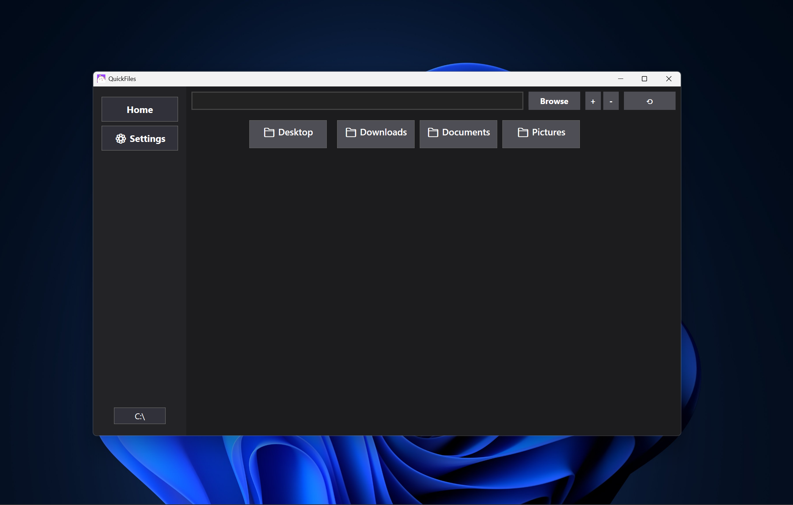
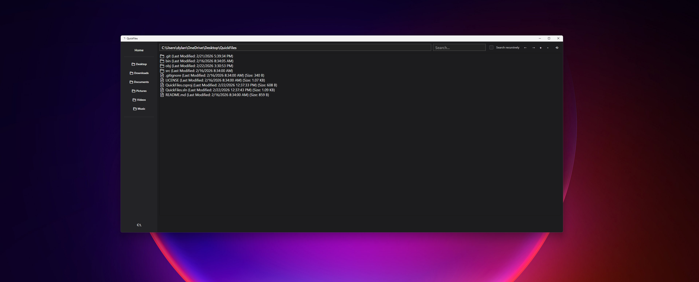

# QuickFiles

A simple, easy to use file manager built with .NET and WPF.

---




---

## About
QuickFiles is a simple, easy to use file manager for Windows. Built with .NET and WPF. The project is actively developed and new features are being worked on!

##  Setup
**Prerequisites:**
- [.NET 6.0 SDK or later](https://dotnet.microsoft.com/download)
- [XAML Styler for VS Code](https://github.com/dabbinavo/vscode-xamlstyler) (recommended)

##  Build & Run
1. **Clone the repository:**
   ```sh
   git clone https://github.com/dylanee300/QuickFiles/
   ```
2. **Open the project folder:**
   ```sh
   code .
   ```
3. **Build and run:**
   ```sh
   dotnet run
   ```

##  Contributing
Contributions are always welcome! Feel free to open a pull request or issue.

---

© 2026 Dylanee
